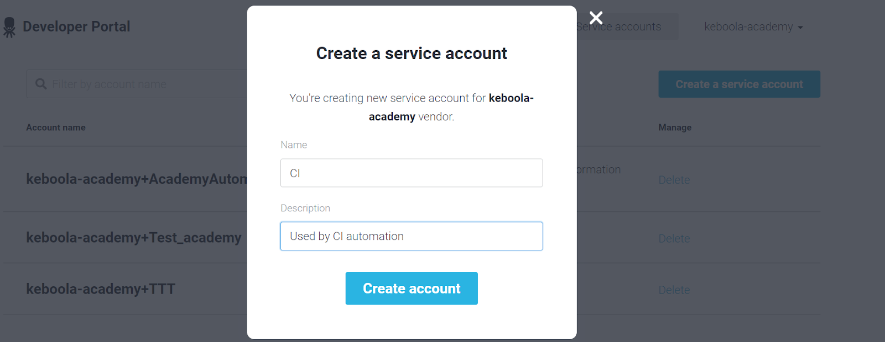

# Empower Workshop : Component Creation

# Important Links

* [Slides used in the workshop](https://github.com/bakobako/keboola-empower-workshop-components/blob/main/resources/slides/empower_components_slides.pdf)
* [Python script that will turn into a component](https://github.com/bakobako/OpenAI-Data-Analyzer)
* [Final code of the component built in the workshop](https://github.com/bakobako/keboola-component-factory-demo.app-openai-workshop-prep)
* [Streamlit app shown in demo](https://github.com/bakobako/Sentiment-Streamlit)

# Workshop steps

Follow these steps, and you'll have a component in no time.

## Step 1: Review the Slides

* Understand the [Developer Portal](https://components.keboola.com/)
* Understand the [Common Interface](https://developers.keboola.com/extend/common-interface/)
* Understand the purpose of the [Component Library](https://github.com/keboola/python-component)
* Understand the purpose of
  the [Component Template](https://bitbucket.org/kds_consulting_team/cookiecutter-python-component/src/master/?search_id=8a6f3c24-3f05-420a-8ec3-5d71cb084024)

## Step 2: Look through the python script

The [Python script](https://github.com/bakobako/OpenAI-Data-Analyzer) is a simple piece of code that uses the OpenAI 
API to analyze text. The input is a base prompt, API token, and a csv file. It goes through a CSV file containing text 
to be analyzed and for each row selects the message column and analyzes the text in that column. The output gets stored 
in an output csv with the same data as the input table, but with an extra column "open_ai_output" containing the response 
of the OpenAI model.

### * Base Prompt
The base prompt contains the instructions to the API, it gets combined with the message to form the prompt for the OpenAI Model, 
e.g. base prompt is "Is the following text positive or negative?" and the message is "I like you", the final prompt would be:

Is the following text positive or negative?

"""
I like you
"""

### * OpenAI API Token

The OpenAI API token can be generated [here](https://platform.openai.com/) click on Personal, 
and select View API keys in drop-down menu. You can then copy the key by clicking on the green text Copy.

### * CSV File

The csv file should contain a column that contains text that should be analyzed.

## Step 3: Register a component in the Developer Portal

To register a component you will need a [Keboola Developer Account and vendor](https://developers.keboola.com/extend/component/tutorial/#before-you-start). 
Go to your account and add a new component.


After you add the component, specify the name of the component.
The name should be as short as possible specifying the service you are going to integrate, e.g. Salesforce, BigQuery, Google Sheets. 
Then specify the type of component in the component type section.

In this case :
* Name : OpenAI
* Type : Application

Once all are filled in, your component ID will be generated, and you can add the component.


## Step 4: Create a component repository in GitHub

This step is very simple. Just go to your GitHub and create a new repository. Name the repository with the ID of the 
component you generated in the previous step, e.g. my-vendor.ex-demo-component. 
It is most common to keep components public, so Keboola staff can view the repository during publishing and others can 
help you maintain the code and generate issues and fixes.

## Step 5: Setup CI variables in GitHub

Once you have a repository, you can already setup the CI repository variables.
Navigate to repository Settings > Secrets and add the following secrets

KBC_DEVELOPERPORTAL_APP — your Component ID.
KBC_DEVELOPERPORTAL_VENDOR — Developer Portal vendor ID
KBC_DEVELOPERPORTAL_USERNAME — service account username
KBC_DEVELOPERPORTAL_PASSWORD — service account password

Each value is explained below.

### APP and VENDOR ID

If your component is named my-vendor.ex-demo-component, then:

* KBC_DEVELOPERPORTAL_APP = my-vendor.ex-demo-component
* KBC_DEVELOPERPORTAL_VENDOR = my-vendor

### Developer Portal service account username and pass

To get a Developer Portal Service account; in the Developer Portal, 
navigate to the Service accounts section and click Create a service account. 
You will be asked to provide name and description:



You will receive username and password that you need to store securely:


Use the username as the KBC_DEVELOPERPORTAL_USERNAME and the password as the KBC_DEVELOPERPORTAL_PASSWORD.

## Step 6: Initialize Python component template with cookiecutter

**Note**
Make sure you have Python 3 and pip installed properly with "python --version" returning a version of Python 3 and 
"pip --version" also returning a version compatible with Python 3.

First install CookieCutter from your terminal using the command:

```
pip install cookiecutter
```

Open your terminal in the directory where you want to store your components locally, and run the CookieCutter script :

```
cookiecutter bb:kds_consulting_team/cookiecutter-python-component.git
```

or if you run it with python then :

```
python -m cookiecutter bb:kds_consulting_team/cookiecutter-python-component.git
```

CookieCutter will then require you to fill in some details about the component:

* Select template variant: Choose GitHub by entering “1”
* Enter the repository URL, e.g. https://github.com/github_user/my-vendor.ex-demo-component
* Enter the component name , e.g. My Demo Component
* Enter the repository folder name, it is best to use the component id, e.g. my-vendor.ex-demo-component
* Enter the component short description; describing the service you are building the component to integrate.
* Enter the component long description; describing the component and its use.
* Enter whether you wish to use flake8 checks for deployment. It’s good to have this turned on to maintain the quality of code.
* Enter whether you want to push a test tag once a branch is updated; this is useful for running a testing version of the component in Keboola without updating the live version of the component.

Once you finish the CookieCutter process you will have a customised template in the directory you had your terminal open in.

## Step 7: Push template to repository and deploy it to Keboola

## Step 8: Develop the component code and UI

## Step 9: Test component locally

## Step 10: Deploy component code to Developer Portal

## Step 11: Run component in Keboola

