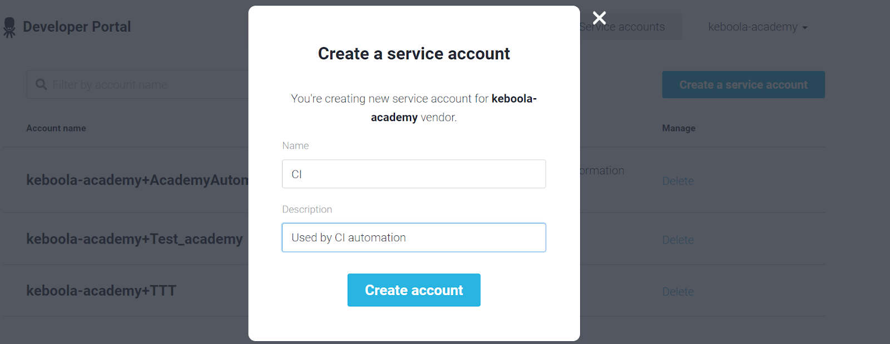
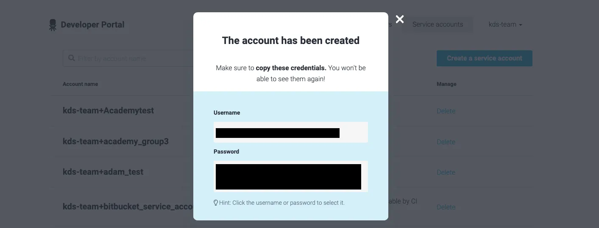

## Step 05: Setup CI variables in GitHub

Once you have a repository, you can already setup the CI repository variables.
Navigate to repository Settings > Secrets and add the following secrets

* KBC_DEVELOPERPORTAL_APP — your Component ID.
* KBC_DEVELOPERPORTAL_VENDOR — Developer Portal vendor ID
* KBC_DEVELOPERPORTAL_USERNAME — service account username
* KBC_DEVELOPERPORTAL_PASSWORD — service account password

Each value is explained below.

### APP and VENDOR ID

If your component is named my-vendor.ex-demo-component, then:

* KBC_DEVELOPERPORTAL_APP = my-vendor.ex-demo-component
* KBC_DEVELOPERPORTAL_VENDOR = my-vendor

### Developer Portal service account username and pass

To get a Developer Portal Service account; in the Developer Portal, 
navigate to the Service accounts section and click Create a service account. 
You will be asked to provide name and description:

You will receive username and password that you need to store securely:

Use the username as the KBC_DEVELOPERPORTAL_USERNAME and the password as the KBC_DEVELOPERPORTAL_PASSWORD.

[Next Step](https://github.com/bakobako/keboola-empower-workshop-components/blob/main/workshop_steps/Step%2006%3A%20Initialize%20Python%20component%20template%20with%20cookiecutter.md)