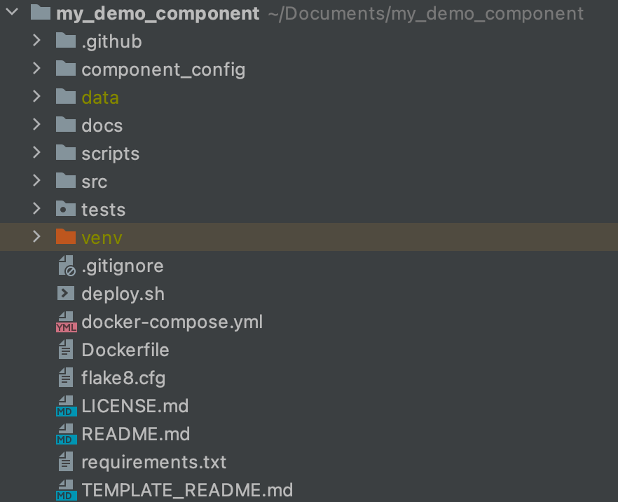

## Step 06: Initialize Python component template with cookiecutter

>**Note**
> 
>Make sure you have Python 3 and pip installed properly with "python --version" returning a version of Python 3 and 
>"pip --version" also returning a version compatible with Python 3.

First install CookieCutter from your terminal using the command:

```
pip install cookiecutter
```

Open your terminal in the directory where you want to store your components locally, and run the CookieCutter script :

```
cookiecutter bb:kds_consulting_team/cookiecutter-python-component.git
```

or if you run it with python then :

```
python -m cookiecutter bb:kds_consulting_team/cookiecutter-python-component.git
```

CookieCutter will then require you to fill in some details about the component:

* Select template variant: Choose GitHub by entering “1”
* Enter the repository URL, e.g. https://github.com/github_user/my-vendor.ex-demo-component
* Enter the component name , e.g. My Demo Component
* Enter the repository folder name, it is best to use the component id, e.g. my-vendor.ex-demo-component
* Enter the component short description; describing the service you are building the component to integrate.
* Enter the component long description; describing the component and its use.
* Enter whether you wish to use flake8 checks for deployment. It’s good to have this turned on to maintain the quality of code.
* Enter whether you want to push a test tag once a branch is updated; this is useful for running a testing version of the component in Keboola without updating the live version of the component.

Once you finish the CookieCutter process you will have a customised template in the directory you had your terminal open in.


## Understanding the component template

There are many subdirectories present in the component template, they will be explained in this section.



### .github Directory

This directory contains all GitHub workflows for the deployment of components. You do not need to change anything in this directory.

### Component Config Directory

This directory contains information about the component, there are multiple files that are important for the configuration of the component, the important ones are:
* component_long_description.md: contains the component long description
* component_short_description.md: contains the component short description
* configRowSchema.json: contains a JSON Schema definition of the component row User Interface.
* configSchema.json: contains a JSON Schema definition of the component User Interface.
* configuration_description.md: contains additional information for the user on how to configure a component.

If updated, these files will be used to update the Developer Portal Properties of the component

### Data Directory
The data directory contains the Keboola Common Interface, a set structure of directories and files with which Keboola Connection communicates with components.
Files and tables that are specified in the input of component configurations are added to the in/files and in/tables respectively, and files and tables in out/files and out/tables are stored in Keboola Connection once the component run finishes. The input and output directories can also contain a State file which holds the state of the component from the previous run.
The Configuration file (config.json) stores all necessary configuration parameters passed on from Keboola Connection on how the component should run.

### Docs Directory

This directory holds some diagrams of the template architecture. It is common to store the component icon here.
### Scripts Directory

This directory holds scripts for running tests and deployment, you do not need to update anything here.

### Source Directory

This directory holds the component code.

### Tests Directory
This directory can have all functional and unit tests that are necessary for your component.


[Next Step](https://github.com/bakobako/keboola-empower-workshop-components/blob/main/workshop_steps/Step%2007%3A%20Push%20template%20to%20repository%20and%20deploy%20it%20to%20Keboola.md)